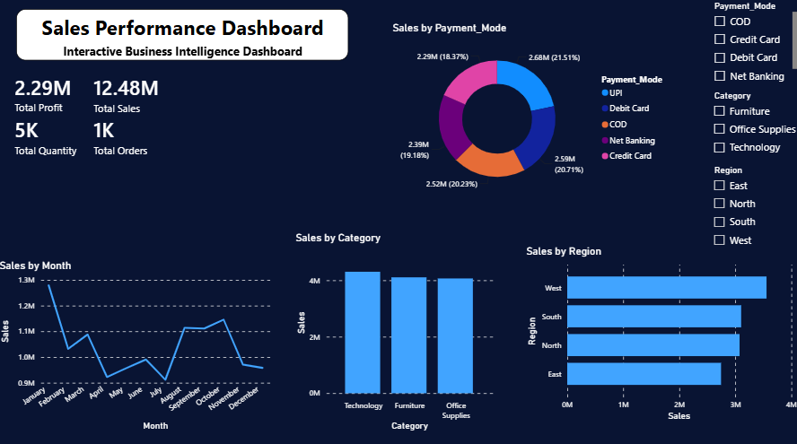

📊 Sales Performance Dashboard

📌 Overview
This project is an interactive Sales Performance Dashboard built in Power BI to analyze business sales data. It provides key performance indicators (KPIs), sales trends, and interactive filters that help users gain insights into sales performance across different regions, categories, and payment methods.

🎯 Objectives
Analyze overall sales performance
Track monthly sales trends
Compare sales across product categories
Compare regional sales performance
Analyze payment mode distribution
Build an interactive dashboard using Power BI

🛠 Tech Stack
Power BI
Microsoft Excel
DAX
Power Query

📂 Dataset
The dataset contains business transaction data including:

Order ID
Order Date
Product Category
Sales
Profit
Quantity
Region
Payment Mode
Customer Details

📊 Dashboard KPIs
Total Sales
Total Profit
Total Quantity
Total Orders

📈 Dashboard Visuals
Sales by Month (Line Chart)
Sales by Category (Column Chart)
Sales by Region (Bar Chart)
Sales by Payment Mode (Donut Chart)
Interactive Slicers
Payment Mode
Region
Category

🚀 Skills Demonstrated
Data Cleaning
Data Modeling
DAX
Power Query
Dashboard Design
KPI Reporting
Business Intelligence
Data Visualization

📷 Dashboard Preview

